# Milestone 2: Análise Exploratória e Engenharia de Atributos

> **Nota de Revisão:** Este documento pressupõe que o dataset já foi identificado e descrito no ficheiro `docs/M1_iniciacao.md`. Caso seja necessário consultar o significado original das variáveis, deve ser consultada essa Milestone. Nesta fase, o foco passa a ser a análise estatística, a qualidade dos dados, a limpeza, a engenharia de atributos e a preparação do dataset para a modelação.

## Enquadramento da Milestone 2

A Milestone 2 corresponde às fases de **Exploratory Data Analysis (EDA)** e **Data Preparation** da metodologia CRISP-DM. O objetivo desta fase foi transformar a inspeção inicial feita na Milestone 1 numa análise mais profunda, com identificação de padrões, correção de problemas de qualidade dos dados e preparação do dataset para a fase de modelação.

O projeto segue uma abordagem de **aprendizagem não supervisionada**, com o objetivo de construir um modelo descritivo de segmentação de clientes. Assim, não existe uma variável-alvo no sentido clássico de classificação ou regressão. A variável `Churn` existe no dataset original, mas não foi utilizada como variável-alvo, pois o objetivo do projeto não é prever abandono, mas sim identificar **3 perfis de clientes estatisticamente caracterizáveis**.

Desta forma, a análise exploratória incidiu sobretudo sobre variáveis relevantes para a diferenciação dos clientes, nomeadamente:

- variáveis demográficas: `gender`, `SeniorCitizen`, `Partner`, `Dependents`;
- variáveis contratuais: `tenure`, `Contract`, `PaperlessBilling`, `PaymentMethod`;
- variáveis de serviços subscritos: `PhoneService`, `InternetService`, `OnlineSecurity`, `OnlineBackup`, `DeviceProtection`, `TechSupport`, `StreamingTV`, `StreamingMovies`, entre outras;
- variáveis de consumo/valor económico: `MonthlyCharges` e `TotalCharges`.

A análise foi desenvolvida no notebook `notebooks/2.0_exploracao.ipynb`, exportado a partir do Kaggle.

---

## 1. Análise Exploratória de Dados (EDA)

### 1.1. Distribuição das variáveis críticas para segmentação

Como o projeto é não supervisionado, esta secção substitui a análise da “variável-alvo” pela análise das variáveis mais relevantes para diferenciar clientes. Foram analisadas principalmente as variáveis numéricas `tenure`, `MonthlyCharges` e `TotalCharges`, por representarem dimensões importantes da relação entre cliente e empresa:

| Variável | Significado | Relevância para segmentação |
| :--- | :--- | :--- |
| `tenure` | Tempo de permanência do cliente, em meses | Ajuda a distinguir clientes recentes de clientes antigos. |
| `MonthlyCharges` | Valor mensal cobrado ao cliente | Ajuda a distinguir clientes com baixo, médio ou elevado valor mensal. |
| `TotalCharges` | Valor total acumulado ao longo da relação com a empresa | Ajuda a distinguir clientes com maior ou menor valor económico acumulado. |

Foram criados histogramas e boxplots para estas variáveis, permitindo observar a distribuição dos valores, a dispersão e a existência de possíveis valores extremos.

#### Resultados estatísticos principais

| Variável | Média | Mediana | Desvio padrão | Mínimo | Máximo | Coeficiente de variação |
| :--- | ---: | ---: | ---: | ---: | ---: | ---: |
| `tenure` | 32.37 | 29.00 | 24.56 | 0.00 | 72.00 | 0.7587 |
| `MonthlyCharges` | 64.76 | 70.35 | 30.09 | 18.25 | 118.75 | 0.4646 |
| `TotalCharges` | 2279.73 | 1394.55 | 2266.79 | 0.00 | 8684.80 | 0.9943 |

A variável `TotalCharges` apresentou o maior coeficiente de variação entre as três variáveis numéricas analisadas, o que indica uma dispersão relativa elevada. Isto é coerente com a natureza da variável, uma vez que o valor total acumulado depende tanto do tempo de permanência (`tenure`) como do valor mensal pago (`MonthlyCharges`).

A variável `tenure` também apresentou dispersão considerável, refletindo a existência de clientes muito recentes e clientes com vários anos de relação com a empresa. A variável `MonthlyCharges` apresentou menor dispersão relativa, mas continua a ser relevante para distinguir clientes com diferentes níveis de consumo mensal.

#### Figuras associadas

As seguintes imagens devem ser guardadas na pasta `reports/figures/` e podem ser referenciadas neste documento:


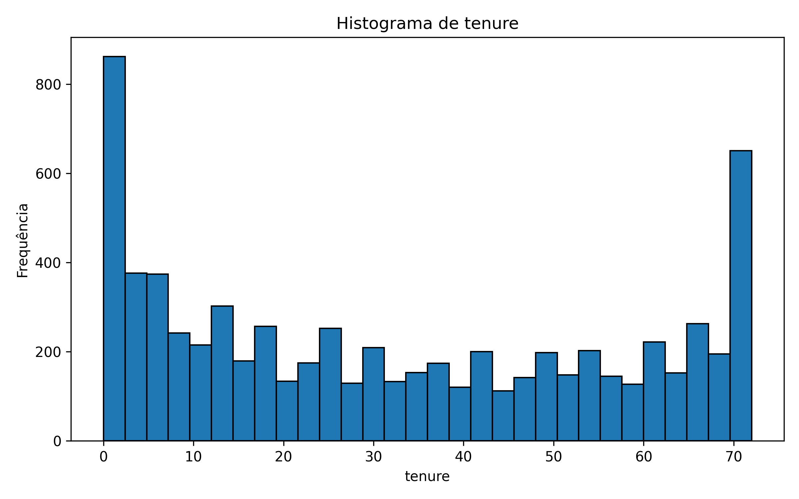
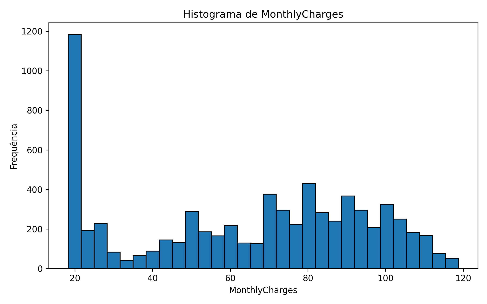
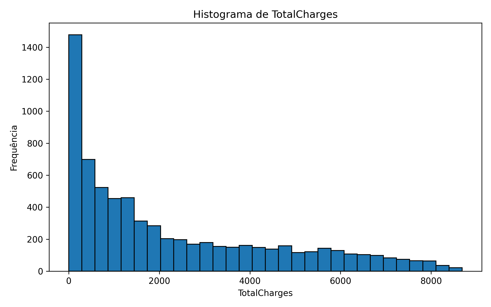
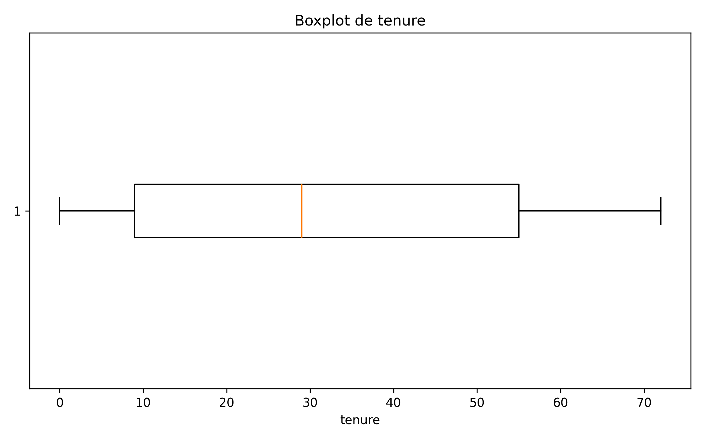


### 1.2. Frequência das variáveis categóricas

Foram analisadas as frequências absolutas e relativas das variáveis categóricas. A variável `customerID` foi excluída por ser apenas um identificador, e a variável `Churn` não foi utilizada como alvo, mantendo a coerência com a abordagem não supervisionada.

As variáveis categóricas analisadas foram:

- `gender`;
- `Partner`;
- `Dependents`;
- `PhoneService`;
- `MultipleLines`;
- `InternetService`;
- `OnlineSecurity`;
- `OnlineBackup`;
- `DeviceProtection`;
- `TechSupport`;
- `StreamingTV`;
- `StreamingMovies`;
- `Contract`;
- `PaperlessBilling`;
- `PaymentMethod`.

Esta análise é importante porque os serviços contratados, o tipo de contrato e o método de pagamento podem contribuir para a formação de perfis diferentes de clientes.

Foram destacados como mais relevantes para a segmentação os seguintes atributos categóricos:

| Variável | Motivo da relevância |
| :--- | :--- |
| `Contract` | Permite distinguir clientes com contrato mensal, anual ou bianual. |
| `InternetService` | Ajuda a distinguir clientes sem internet, com DSL ou com fibra ótica. |
| `PaymentMethod` | Pode refletir diferenças no comportamento de pagamento. |
| `OnlineSecurity` | Representa adesão a serviço adicional de segurança. |
| `TechSupport` | Representa adesão a apoio técnico. |
| `PaperlessBilling` | Representa opção de faturação digital. |
| `MultipleLines` | Representa utilização de múltiplas linhas telefónicas. |

#### Figuras associadas

Para não tornar o relatório demasiado extenso, recomenda-se destacar no GitHub apenas as figuras categóricas mais relevantes para o objetivo SMART:


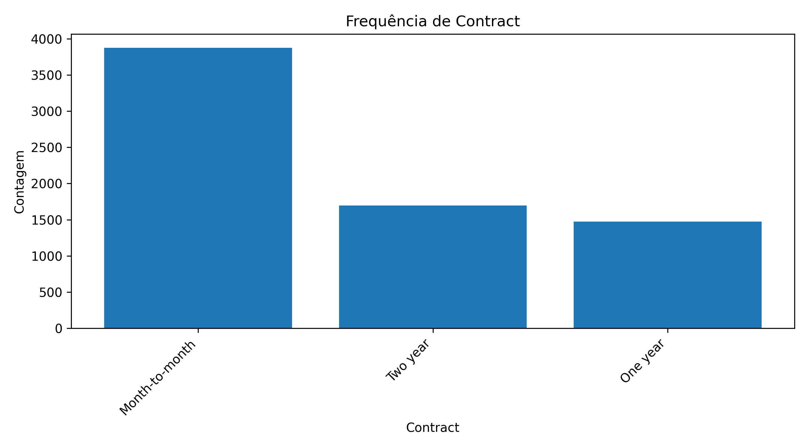
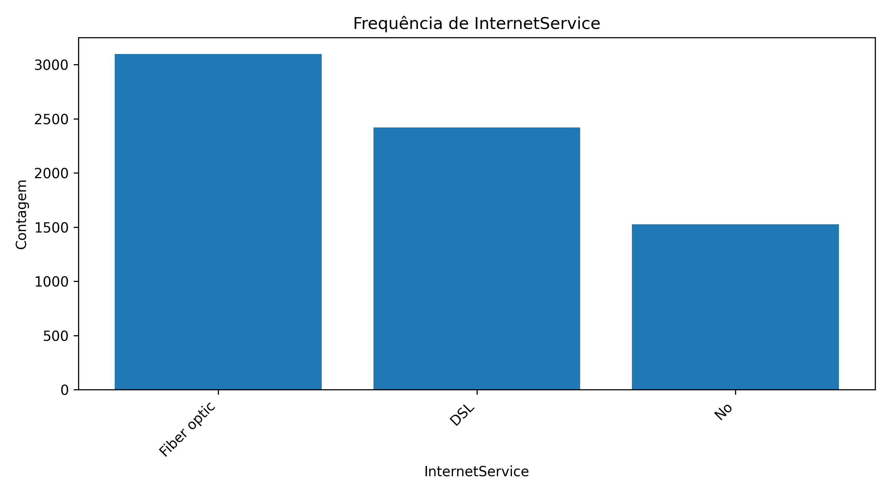
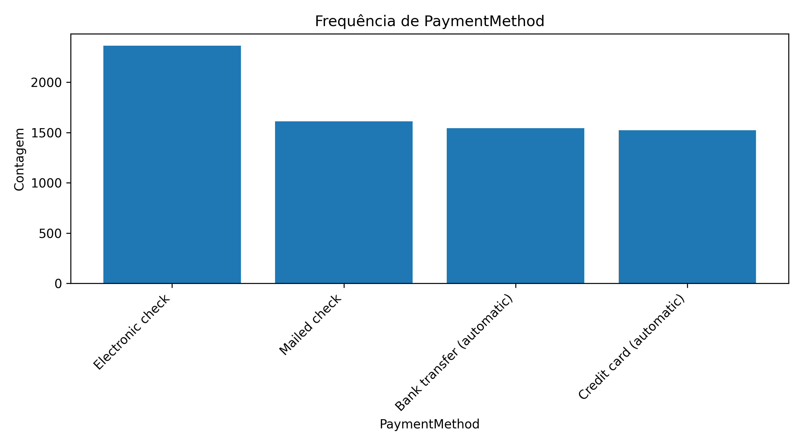

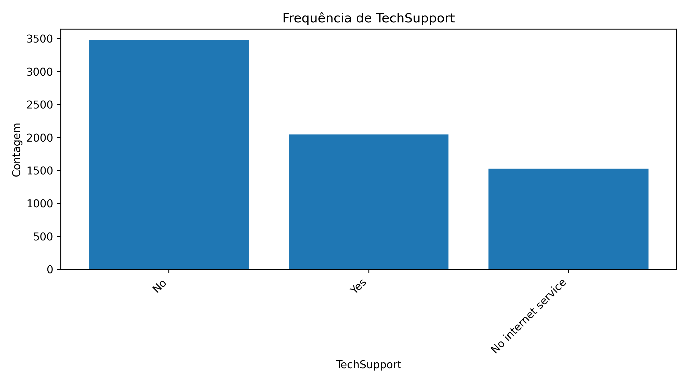


---

## 1.3. Análise bivariada e correlações relevantes

A análise bivariada teve como objetivo identificar relações factuais entre variáveis críticas para a segmentação. Como não existe variável-alvo, foram analisadas relações entre atributos relevantes para a diferenciação dos clientes.

Foi gerada uma matriz de correlação com as variáveis `tenure`, `MonthlyCharges`, `TotalCharges` e `SeniorCitizen`.

### Matriz de correlação

| Relação | Correlação |
| :--- | ---: |
| `tenure` vs. `TotalCharges` | 0.8262 |
| `MonthlyCharges` vs. `TotalCharges` | 0.6512 |
| `tenure` vs. `MonthlyCharges` | 0.2479 |
| `MonthlyCharges` vs. `SeniorCitizen` | 0.2202 |
| `TotalCharges` vs. `SeniorCitizen` | 0.1030 |
| `tenure` vs. `SeniorCitizen` | 0.0166 |

### Interpretação

A correlação mais elevada foi observada entre `tenure` e `TotalCharges` (0.8262). Este resultado é esperado, porque clientes com maior tempo de permanência tendem a acumular encargos totais mais elevados.

A relação entre `MonthlyCharges` e `TotalCharges` também foi positiva (0.6512), indicando que clientes com mensalidades mais elevadas tendem, em geral, a acumular valores totais superiores.

A correlação entre `tenure` e `MonthlyCharges` foi mais baixa (0.2479), sugerindo que o tempo de permanência e o valor mensal não representam exatamente a mesma dimensão do comportamento do cliente. Isto é relevante para a segmentação, pois permite que os clusters distingam clientes antigos com baixo valor mensal, clientes recentes com alto valor mensal, entre outros perfis possíveis.

### Conclusões visuais principais

1. **`tenure` e `TotalCharges` apresentam uma relação positiva forte.** Clientes com maior permanência acumulam, em geral, maior valor total.
2. **`MonthlyCharges` e `TotalCharges` apresentam uma relação positiva moderada/forte.** Clientes com encargos mensais mais altos tendem a ter maior valor acumulado.
3. **As variáveis contratuais e de serviços ajudam a contextualizar a dispersão dos clientes.** Os gráficos com `Contract` e `InternetService` permitem observar diferenças de comportamento entre grupos contratuais e tipos de serviço.

#### Figuras associadas


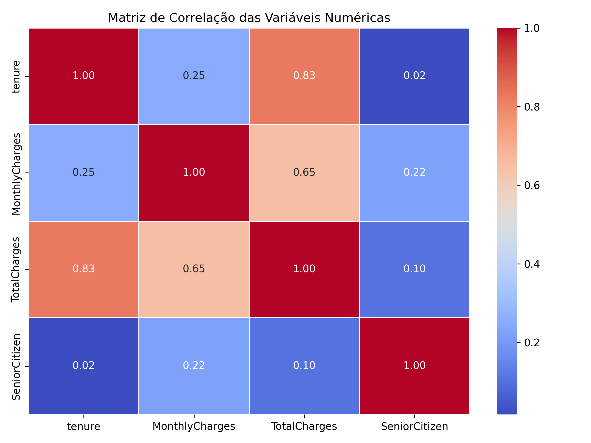
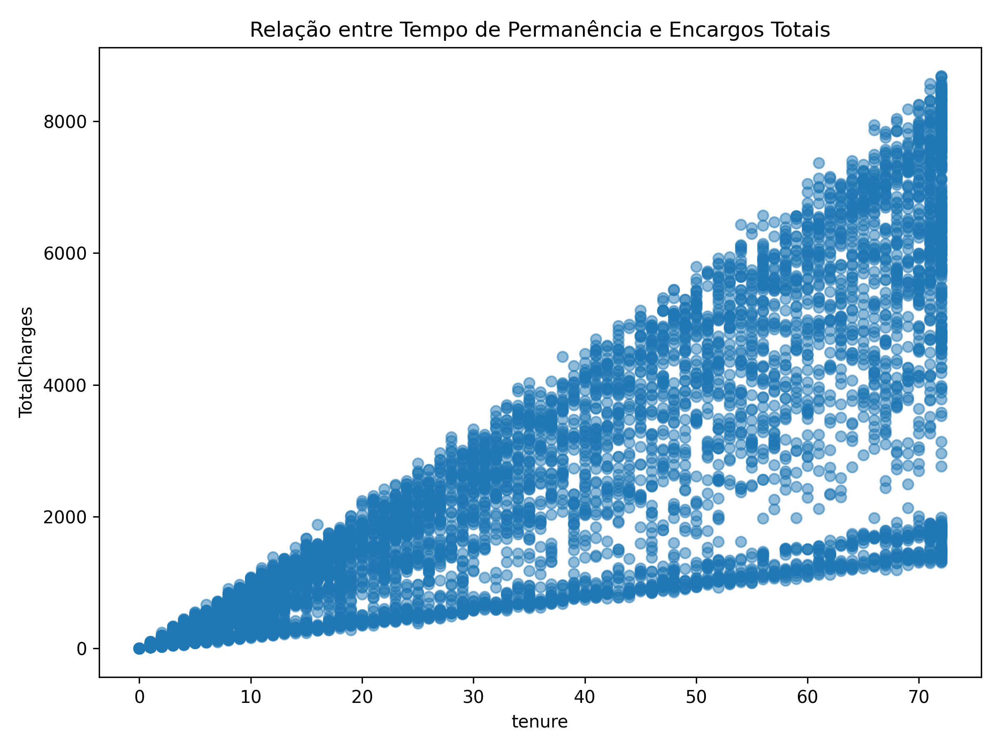
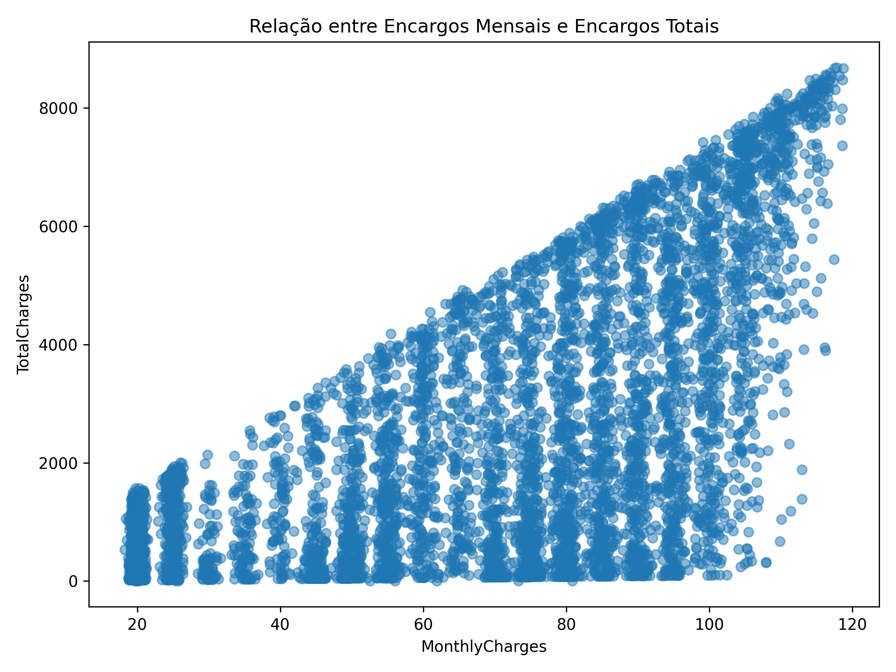
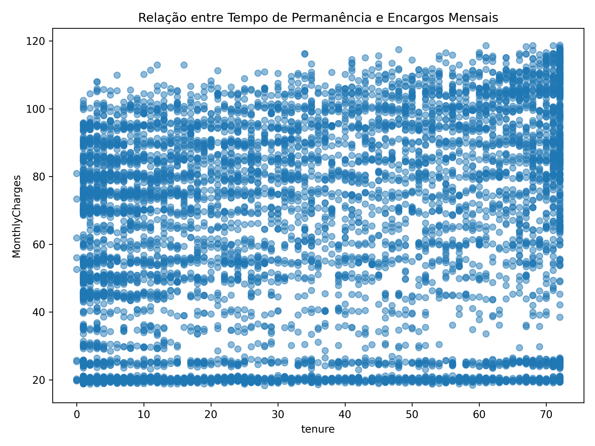
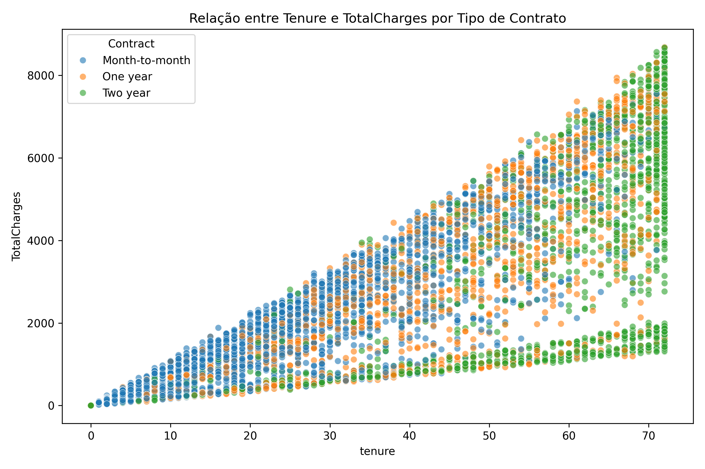
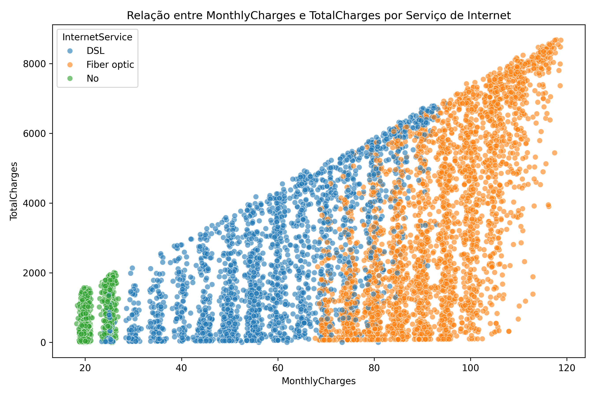


---

## 2. Qualidade dos Dados e Limpeza

### 2.1. Tratamento de Dados em Falta (Missing Data)

Foi calculada a percentagem de valores em falta por coluna. Na inspeção inicial, o método `isna()` não identificou valores nulos nas colunas originais. No entanto, foi identificado um problema específico na variável `TotalCharges`: esta coluna estava lida como texto (`object`), apesar de representar um valor monetário.

Ao converter `TotalCharges` para formato numérico com `pd.to_numeric(..., errors='coerce')`, foram identificados **11 valores problemáticos**, correspondentes a **0.16%** dos registos.

Estes 11 valores estavam associados a clientes com `tenure = 0`. Como `tenure = 0` indica ausência de tempo de permanência, a decisão aplicada foi preencher `TotalCharges` com `0` nesses casos.

| Aspeto | Resultado |
| :--- | :--- |
| Valores problemáticos após conversão de `TotalCharges` | 11 |
| Percentagem aproximada | 0.16% |
| Condição observada | Registos com `tenure = 0` |
| Estratégia aplicada | Preenchimento de `TotalCharges` com 0 |
| Valores em falta após tratamento | 0 |

### Justificação da estratégia

A eliminação das linhas não foi escolhida porque os 11 registos representam clientes reais e o problema estava associado à representação do valor em `TotalCharges`, não a uma ausência generalizada de informação.

Também não foi escolhida imputação pela média ou mediana para estes casos específicos, porque, quando `tenure = 0`, a interpretação mais coerente é que o cliente ainda não acumulou encargos totais. Assim, o valor `0` é mais interpretável do que uma média ou mediana artificial.

Foi definida adicionalmente uma regra geral para eventuais valores em falta futuros:

- variáveis numéricas: preenchimento pela mediana, por ser menos sensível a valores extremos do que a média;
- variáveis categóricas: preenchimento pela moda, por representar a categoria mais frequente.

No final do tratamento, o dataset ficou com **0 valores em falta**.

### 2.2. Outliers e inconsistências

Foram analisados possíveis erros e valores extremos nas variáveis numéricas mais relevantes para a segmentação:

- `tenure`;
- `MonthlyCharges`;
- `TotalCharges`.

Antes da análise de outliers, foi corrigido o tipo de dados de `TotalCharges`, que passou de texto para variável numérica (`float64`). Esta correção era necessária porque algoritmos de segmentação e medidas estatísticas não conseguem trabalhar corretamente com valores monetários armazenados como texto.

### Verificação de valores impossíveis

| Variável | Mínimo | Máximo | Média | Mediana | Valores negativos |
| :--- | ---: | ---: | ---: | ---: | ---: |
| `tenure` | 0.00 | 72.00 | 32.37 | 29.00 | 0 |
| `MonthlyCharges` | 18.25 | 118.75 | 64.76 | 70.35 | 0 |
| `TotalCharges` | 0.00 | 8684.80 | 2279.73 | 1394.55 | 0 |

Não foram identificados valores negativos nestas variáveis. Assim, não foram encontrados valores impossíveis do tipo `tenure < 0`, `MonthlyCharges < 0` ou `TotalCharges < 0`.

### Identificação de outliers pelo método IQR

Foi aplicado o método IQR às variáveis `tenure`, `MonthlyCharges` e `TotalCharges`.

| Variável | Q1 | Q3 | IQR | Limite inferior | Limite superior | Nº de outliers | % de outliers |
| :--- | ---: | ---: | ---: | ---: | ---: | ---: | ---: |
| `tenure` | 9.00 | 55.00 | 46.00 | -60.000 | 124.000 | 0 | 0.0% |
| `MonthlyCharges` | 35.50 | 89.85 | 54.35 | -46.025 | 171.375 | 0 | 0.0% |
| `TotalCharges` | 398.55 | 3786.60 | 3388.05 | -4683.525 | 8868.675 | 0 | 0.0% |

Com base no método IQR, não foram identificados outliers nestas variáveis. Ainda assim, foram criadas colunas indicadoras de outliers (`tenure_outlier`, `MonthlyCharges_outlier` e `TotalCharges_outlier`) para documentar a verificação realizada. Todas ficaram com valor total 0.

### Decisão sobre outliers

Não foram removidos registos por outliers. Esta decisão foi tomada porque:

- não foram identificados outliers pelo método IQR;
- os valores máximos observados são plausíveis no contexto do negócio;
- a remoção automática poderia eliminar clientes reais com maior permanência ou maior valor económico;
- a fase de modelação utilizará escalonamento para controlar diferenças de escala entre variáveis.

#### Figuras associadas


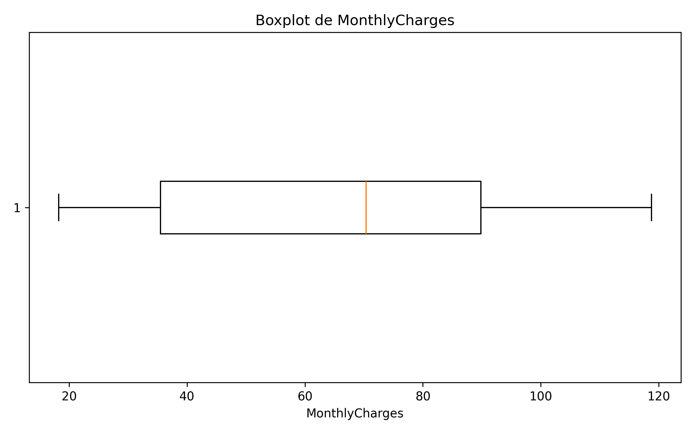
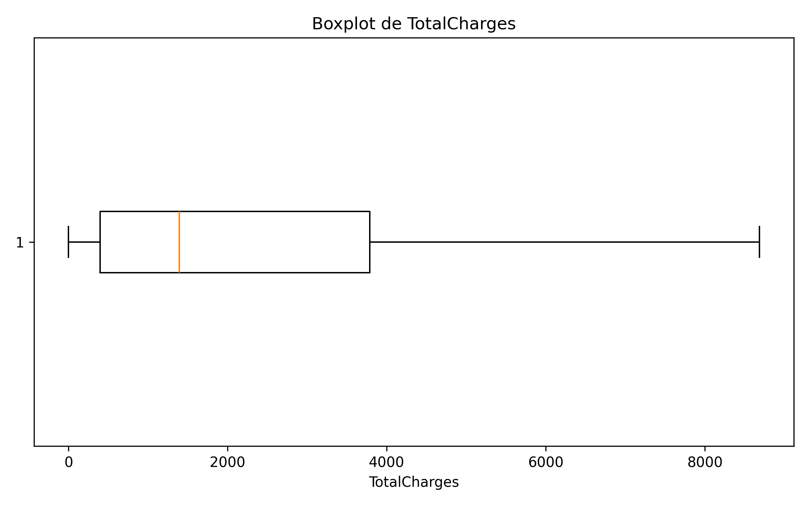


---

## 3. Engenharia de Atributos (Feature Engineering)

### 3.1. Transformações realizadas

A transformação de variáveis foi feita para preparar o dataset para algoritmos de segmentação. Como estes algoritmos trabalham com informação numérica, foi necessário converter variáveis categóricas e colocar variáveis contínuas numa escala comparável.

### Seleção inicial de variáveis para transformação

Foram selecionadas 19 variáveis alinhadas com o Objetivo SMART:

- `gender`;
- `SeniorCitizen`;
- `Partner`;
- `Dependents`;
- `tenure`;
- `Contract`;
- `PaperlessBilling`;
- `PaymentMethod`;
- `PhoneService`;
- `MultipleLines`;
- `InternetService`;
- `OnlineSecurity`;
- `OnlineBackup`;
- `DeviceProtection`;
- `TechSupport`;
- `StreamingTV`;
- `StreamingMovies`;
- `MonthlyCharges`;
- `TotalCharges`.

A variável `customerID` foi excluída por ser apenas um identificador. A variável `Churn` foi excluída da preparação para modelação, uma vez que o projeto é não supervisionado.

### Encoding

Foi aplicado **One-Hot Encoding** às variáveis categóricas. Esta técnica foi escolhida porque as categorias do dataset não têm uma ordem natural. Por exemplo, não faz sentido atribuir uma hierarquia artificial entre `DSL`, `Fiber optic` e `No`, ou entre os diferentes métodos de pagamento.

Na primeira transformação, o dataset passou de **19 variáveis** para **45 atributos** após o One-Hot Encoding.

### Escalonamento

As variáveis numéricas `tenure`, `MonthlyCharges` e `TotalCharges` foram escalonadas com **StandardScaler**. Esta decisão foi tomada porque algoritmos de clustering baseados em distância, como K-Means, são sensíveis à escala das variáveis. Sem escalonamento, uma variável como `TotalCharges`, que tem valores muito superiores aos de `tenure`, poderia dominar indevidamente o cálculo das distâncias.

Após o escalonamento, as variáveis numéricas ficaram centradas aproximadamente em média 0 e desvio padrão próximo de 1.

| Variável | Média após escalonamento | Desvio padrão após escalonamento |
| :--- | ---: | ---: |
| `tenure` | aproximadamente 0 | aproximadamente 1 |
| `MonthlyCharges` | aproximadamente 0 | aproximadamente 1 |
| `TotalCharges` | aproximadamente 0 | aproximadamente 1 |

A validação final confirmou que, após transformação:

- não existiam colunas não numéricas;
- não existiam valores em falta;
- `Churn` não estava presente no dataset preparado;
- `customerID` não estava presente no dataset preparado;
- o dataset transformado tinha dimensão **7043 linhas × 45 colunas** antes da seleção final de atributos.

### 3.2. Criação de novos atributos

Foram criadas três novas variáveis a partir das variáveis existentes. Embora o enunciado peça pelo menos duas novas variáveis, foram criadas três para enriquecer a análise.

| Nova variável | Como foi criada | Objetivo |
| :--- | :--- | :--- |
| `ServiceCount` | Soma dos serviços subscritos com valor `Yes` | Medir o nível de utilização de serviços por cliente. |
| `AvgChargePerTenure` | `TotalCharges / tenure`, com valor 0 quando `tenure = 0` | Representar o valor médio acumulado por mês de permanência. |
| `HasInternetService` | 1 quando `InternetService != No`; 0 caso contrário | Distinguir clientes com e sem serviço de internet. |

### Estatísticas das novas variáveis

| Variável | Média | Desvio padrão | Mínimo | Mediana | Máximo |
| :--- | ---: | ---: | ---: | ---: | ---: |
| `ServiceCount` | 3.36 | 2.06 | 0.00 | 3.00 | 8.00 |
| `AvgChargePerTenure` | 64.70 | 30.27 | 0.00 | 70.30 | 121.40 |
| `HasInternetService` | 0.78 | 0.41 | 0.00 | 1.00 | 1.00 |

Não foram identificados valores em falta nas novas variáveis.

### Relação das novas variáveis com atributos críticos

Como o projeto não tem variável-alvo, a utilidade das novas variáveis foi avaliada através da sua relação com variáveis críticas para a segmentação.

| Relação | Correlação |
| :--- | ---: |
| `MonthlyCharges` vs. `AvgChargePerTenure` | 0.9944 |
| `MonthlyCharges` vs. `ServiceCount` | 0.8023 |
| `ServiceCount` vs. `AvgChargePerTenure` | 0.7974 |
| `TotalCharges` vs. `ServiceCount` | 0.7959 |
| `MonthlyCharges` vs. `HasInternetService` | 0.7636 |
| `AvgChargePerTenure` vs. `HasInternetService` | 0.7585 |
| `tenure` vs. `ServiceCount` | 0.5236 |

A nova variável `ServiceCount` mostrou relação relevante com `MonthlyCharges` e `TotalCharges`, o que faz sentido: clientes com mais serviços subscritos tendem a pagar mais por mês e a acumular maior valor total.

A variável `AvgChargePerTenure` apresentou correlação muito elevada com `MonthlyCharges` (0.9944). Por esse motivo, apesar de ter sido criada e analisada, foi posteriormente removida na fase de seleção de atributos por redundância.

A variável `HasInternetService` também apresentou relação relevante com `MonthlyCharges`, mas foi mantida na versão final porque resume de forma simples a distinção entre clientes com e sem serviço de internet.

### Relação com variáveis categóricas relevantes

Foram também calculadas médias das novas variáveis por categorias de `Contract`, `InternetService` e `PaymentMethod`.

#### Por tipo de contrato

| Contract | ServiceCount médio | AvgChargePerTenure médio | HasInternetService médio |
| :--- | ---: | ---: | ---: |
| Month-to-month | 2.84 | 66.38 | 0.86 |
| One year | 3.82 | 65.06 | 0.75 |
| Two year | 4.17 | 60.54 | 0.62 |

Os clientes com contrato de dois anos apresentaram, em média, maior número de serviços subscritos (`ServiceCount = 4.17`).

#### Por tipo de serviço de internet

| InternetService | ServiceCount médio | AvgChargePerTenure médio | HasInternetService médio |
| :--- | ---: | ---: | ---: |
| DSL | 3.67 | 57.98 | 1.00 |
| Fiber optic | 4.18 | 91.46 | 1.00 |
| No | 1.22 | 21.05 | 0.00 |

Clientes com fibra ótica apresentaram maior média de `ServiceCount` e maior `AvgChargePerTenure`, o que sugere um perfil com maior intensidade de serviços e maior valor económico médio.

#### Por método de pagamento

| PaymentMethod | ServiceCount médio | AvgChargePerTenure médio | HasInternetService médio |
| :--- | ---: | ---: | ---: |
| Bank transfer (automatic) | 3.85 | 67.09 | 0.78 |
| Credit card (automatic) | 3.88 | 66.48 | 0.78 |
| Electronic check | 3.47 | 76.26 | 0.95 |
| Mailed check | 2.26 | 43.76 | 0.54 |

Os clientes com `Electronic check` apresentaram maior média de `AvgChargePerTenure` e maior proporção de clientes com serviço de internet. Esta observação pode ser útil para a interpretação dos segmentos na Milestone 3, mas não deve ser interpretada como relação causal.

#### Figuras associadas


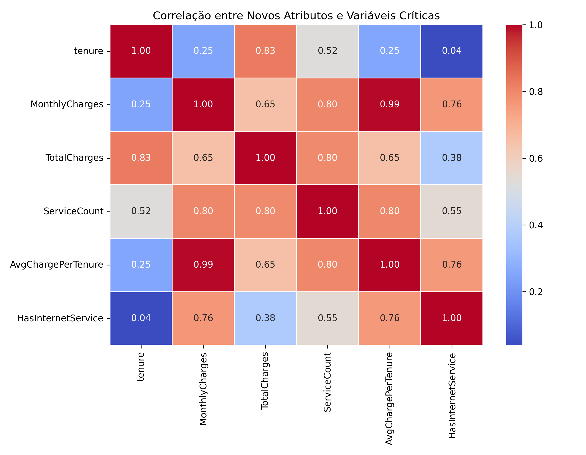
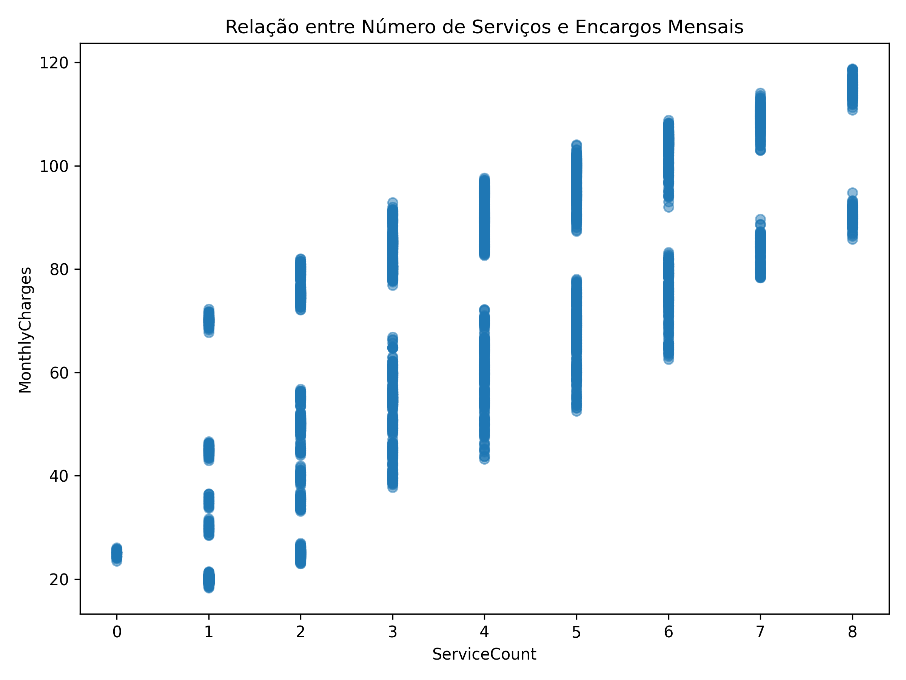
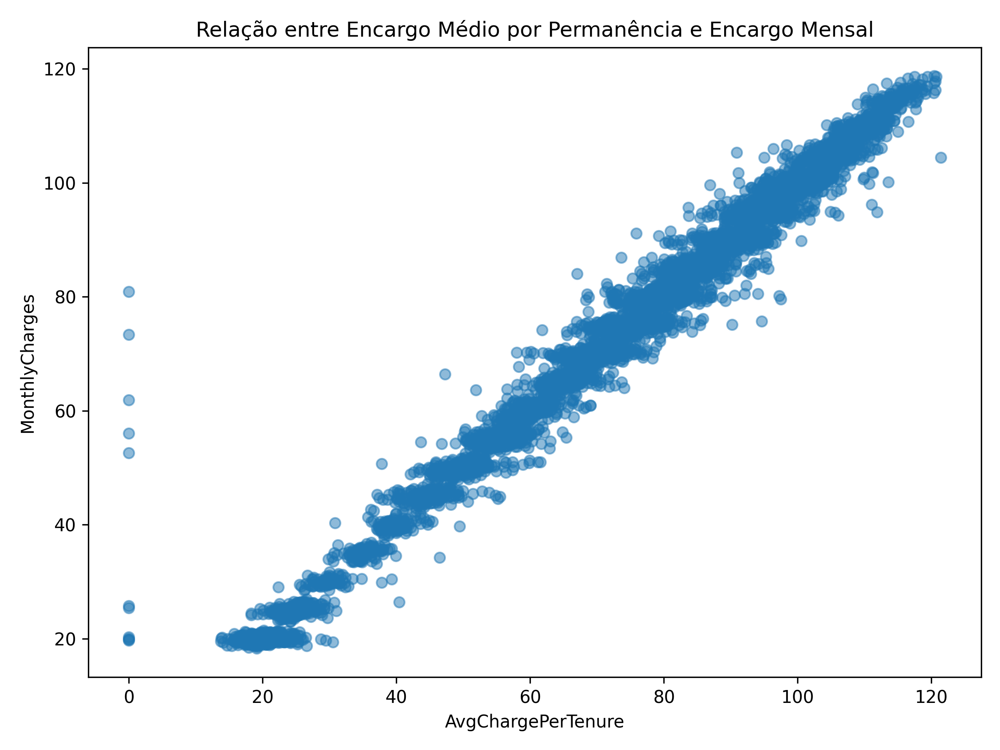
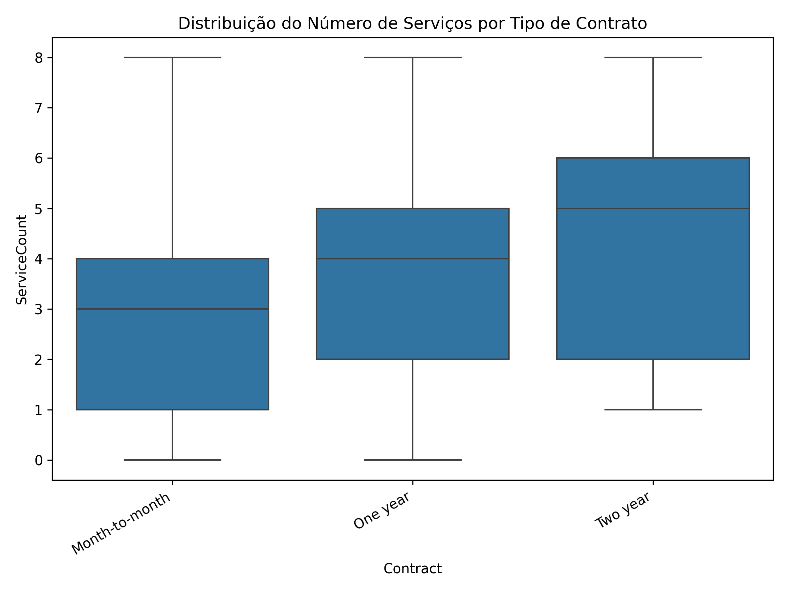


---

## 3.3. Seleção de atributos

A seleção de atributos teve como objetivo consolidar o dataset final para modelação, removendo variáveis não informativas, redundantes ou com correlação demasiado elevada.

### Critérios aplicados

| Critério | Aplicação | Justificação |
| :--- | :--- | :--- |
| Remoção de identificadores | `customerID` removido | Não contribui para a segmentação. |
| Exclusão de `Churn` | `Churn` removido | O projeto é não supervisionado. |
| One-Hot Encoding com redução de redundância | `drop_first=True` | Evita representação duplicada de categorias. |
| Remoção de constantes | Nenhuma coluna constante removida | Não existiam atributos com apenas um valor. |
| Remoção por correlação elevada | Limiar de correlação absoluta > 0.90 | Reduz redundância e multicolinearidade. |

### Resultado da seleção

Após o One-Hot Encoding com redução de redundância, o dataset tinha **7043 linhas × 33 atributos**. Não foram identificadas colunas constantes.

Foi depois calculada uma matriz de correlação absoluta entre atributos codificados. Foram removidos atributos com correlação absoluta superior a 0.90.

Foram removidas as seguintes variáveis por correlação elevada:

| Variável removida | Motivo |
| :--- | :--- |
| `AvgChargePerTenure` | Correlação elevada com `MonthlyCharges` |
| `MultipleLines_No phone service` | Redundância com informação de `PhoneService` |
| `InternetService_No` | Redundância com variáveis “No internet service” e `HasInternetService` |
| `OnlineSecurity_No internet service` | Redundância com ausência de serviço de internet |
| `OnlineBackup_No internet service` | Redundância com ausência de serviço de internet |
| `DeviceProtection_No internet service` | Redundância com ausência de serviço de internet |
| `TechSupport_No internet service` | Redundância com ausência de serviço de internet |
| `StreamingTV_No internet service` | Redundância com ausência de serviço de internet |
| `StreamingMovies_No internet service` | Redundância com ausência de serviço de internet |

Após esta etapa, o dataset passou de **33 atributos** para **24 atributos finais**.

### Escalonamento final

Depois da seleção, foram escalonadas as variáveis contínuas:

- `tenure`;
- `MonthlyCharges`;
- `TotalCharges`;
- `ServiceCount`.

O atributo `AvgChargePerTenure` já não foi escalonado na versão final porque foi removido por correlação elevada.

### Validação final

A validação final do dataset processado confirmou que:

- o dataset final tem **7043 linhas e 24 atributos**;
- não existem colunas não numéricas;
- não existem valores em falta;
- `Churn` não está no dataset final;
- `customerID` não está no dataset final.

O ficheiro final foi guardado em:

```text
data/processed/telco_customer_churn_m2_final_processado.csv
```

Também foram guardados ficheiros auxiliares:

```text
data/processed/lista_atributos_finais_m2.csv
data/processed/atributos_removidos_m2.csv
```

#### Figura associada


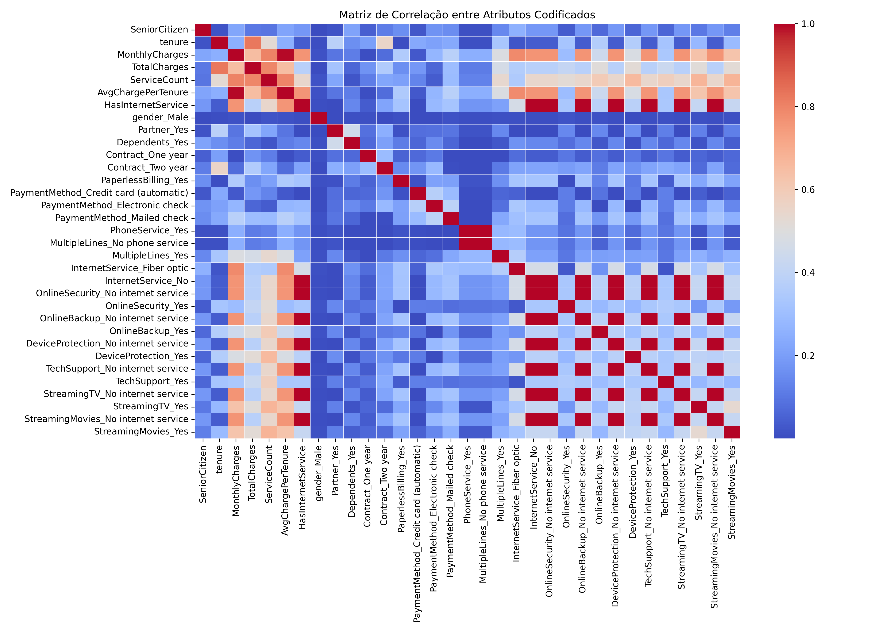


---

## 4. Dicionário de Dados Final (Pós-Processamento)

A tabela seguinte apresenta os atributos finais entregues à fase de modelação.

| Atributo | Tipo | Descrição |
| :--- | :--- | :--- |
| `SeniorCitizen` | Binário | Indica se o cliente é sénior: 1 = sim, 0 = não. |
| `tenure` | Numérico escalonado | Tempo de permanência do cliente, após StandardScaler. |
| `MonthlyCharges` | Numérico escalonado | Encargo mensal do cliente, após StandardScaler. |
| `TotalCharges` | Numérico escalonado | Encargo total acumulado, após correção de tipo e StandardScaler. |
| `ServiceCount` | Numérico escalonado | Número de serviços subscritos pelo cliente, após StandardScaler. |
| `HasInternetService` | Binário | 1 = cliente tem serviço de internet; 0 = não tem. |
| `gender_Male` | Binário | Resultado do One-Hot Encoding da variável `gender`. |
| `Partner_Yes` | Binário | Indica se o cliente tem parceiro/a. |
| `Dependents_Yes` | Binário | Indica se o cliente tem dependentes. |
| `Contract_One year` | Binário | Indica contrato de um ano. |
| `Contract_Two year` | Binário | Indica contrato de dois anos. |
| `PaperlessBilling_Yes` | Binário | Indica faturação digital. |
| `PaymentMethod_Credit card (automatic)` | Binário | Indica pagamento por cartão de crédito automático. |
| `PaymentMethod_Electronic check` | Binário | Indica pagamento por cheque eletrónico. |
| `PaymentMethod_Mailed check` | Binário | Indica pagamento por cheque enviado por correio. |
| `PhoneService_Yes` | Binário | Indica se o cliente tem serviço telefónico. |
| `MultipleLines_Yes` | Binário | Indica se o cliente tem múltiplas linhas. |
| `InternetService_Fiber optic` | Binário | Indica serviço de internet por fibra ótica. |
| `OnlineSecurity_Yes` | Binário | Indica subscrição de segurança online. |
| `OnlineBackup_Yes` | Binário | Indica subscrição de backup online. |
| `DeviceProtection_Yes` | Binário | Indica subscrição de proteção de dispositivo. |
| `TechSupport_Yes` | Binário | Indica subscrição de suporte técnico. |
| `StreamingTV_Yes` | Binário | Indica subscrição de streaming TV. |
| `StreamingMovies_Yes` | Binário | Indica subscrição de streaming de filmes. |

### Variáveis removidas

| Variável | Motivo |
| :--- | :--- |
| `customerID` | Identificador sem valor analítico para clustering. |
| `Churn` | Excluída por o projeto ser não supervisionado. |
| `AvgChargePerTenure` | Correlação elevada com `MonthlyCharges`. |
| Variáveis `No internet service` | Redundantes com ausência de serviço de internet e com `HasInternetService`. |
| `MultipleLines_No phone service` | Redundante com informação de serviço telefónico. |

---

## 5. Figuras a adicionar ao GitHub

As imagens geradas no Kaggle devem ser colocadas na pasta:

```text
reports/figures/
```

### Figuras essenciais para documentar a M2

| Ficheiro | Secção onde deve ser usado | Motivo |
| :--- | :--- | :--- |
| `histograma_tenure.png` | 1.1 | Mostra distribuição do tempo de permanência. |
| `histograma_MonthlyCharges.png` | 1.1 | Mostra distribuição dos encargos mensais. |
| `histograma_TotalCharges.png` | 1.1 | Mostra distribuição dos encargos totais. |
| `boxplot_tenure.png` | 1.1 / 2.2 | Apoia análise de dispersão e outliers. |
| `boxplot_MonthlyCharges.png` | 1.1 / 2.2 | Apoia análise de dispersão e outliers. |
| `boxplot_TotalCharges.png` | 1.1 / 2.2 | Apoia análise de dispersão e outliers. |
| `frequencia_Contract.png` | 1.2 | Mostra distribuição dos tipos de contrato. |
| `frequencia_InternetService.png` | 1.2 | Mostra distribuição dos serviços de internet. |
| `frequencia_PaymentMethod.png` | 1.2 | Mostra distribuição dos métodos de pagamento. |
| `heatmap_correlacao_variaveis_numericas.png` | 1.3 | Mostra correlação entre variáveis numéricas críticas. |
| `scatter_tenure_totalcharges.png` | 1.3 | Mostra relação entre permanência e valor acumulado. |
| `scatter_monthlycharges_totalcharges.png` | 1.3 | Mostra relação entre mensalidade e valor acumulado. |
| `scatter_tenure_totalcharges_contract.png` | 1.3 | Mostra relação económica por tipo de contrato. |
| `heatmap_novos_atributos_variaveis_criticas.png` | 3.2 | Mostra relação dos novos atributos com variáveis críticas. |
| `scatter_servicecount_monthlycharges.png` | 3.2 | Mostra relação entre número de serviços e mensalidade. |
| `boxplot_servicecount_contract.png` | 3.2 | Mostra diferenças no número de serviços por tipo de contrato. |
| `heatmap_feature_selection_correlacao.png` | 3.3 | Documenta redundância entre atributos para seleção final. |

As restantes figuras de frequência categórica também podem ser guardadas em `reports/figures/`, mas não precisam necessariamente de aparecer todas no relatório para evitar excesso visual.

---

## 6. Conclusões da Fase de Exploração

A Milestone 2 permitiu aprofundar a compreensão estatística do dataset e preparar os dados para a fase de modelação.

As principais conclusões foram:

1. **As variáveis `tenure`, `MonthlyCharges` e `TotalCharges` são relevantes para a diferenciação de clientes.** `TotalCharges` apresentou a maior dispersão relativa e está fortemente correlacionada com `tenure`.

2. **A variável `TotalCharges` exigiu correção de tipo.** Inicialmente estava lida como texto, apesar de representar valores monetários. Após conversão para numérico, foram identificados 11 valores problemáticos associados a `tenure = 0`, que foram tratados com preenchimento por 0.

3. **Não foram identificados outliers pelo método IQR nas principais variáveis numéricas.** Também não foram encontrados valores negativos ou incoerentes em `tenure`, `MonthlyCharges` e `TotalCharges`.

4. **Foram criados novos atributos relevantes para a segmentação.** `ServiceCount`, `AvgChargePerTenure` e `HasInternetService` permitiram explorar dimensões agregadas de serviços e valor económico.

5. **A seleção de atributos reduziu redundância.** A variável `AvgChargePerTenure` foi removida por correlação muito elevada com `MonthlyCharges`, e várias categorias “No internet service” foram removidas por redundância.

6. **O dataset final está pronto para a Milestone 3.** A versão final contém 7043 linhas e 24 atributos numéricos, sem valores em falta, sem identificadores e sem `Churn` como variável-alvo.

Assim, os dados estão preparados para a fase de modelação não supervisionada, onde serão testados algoritmos de clustering e avaliada a capacidade de identificar 3 perfis de clientes estatisticamente caracterizáveis.

---

## 7. Referências e rastreabilidade

- Dataset original: Telco Customer Churn, disponível no Kaggle.
- Notebook principal da Milestone 2: `notebooks/2.0_exploracao.ipynb`.
- Dataset processado final: `data/processed/telco_customer_churn_m2_final_processado.csv`.
- Lista de atributos finais: `data/processed/lista_atributos_finais_m2.csv`.
- Atributos removidos: `data/processed/atributos_removidos_m2.csv`.
- Figuras principais: `reports/figures/`.
- Documentação anterior: `docs/M1_iniciacao.md`.

---

*Data de última atualização: 08/06/2026*
