# Milestone 3: Modelação e Avaliação

## 1. Estratégia de Modelação

Nesta milestone foi desenvolvida a fase de **modelação e avaliação** do projeto, seguindo a lógica do CRISP-DM. Como o objetivo do trabalho é construir um **modelo descritivo de segmentação de clientes**, a abordagem adotada foi **não supervisionada**, através de algoritmos de clustering.

O objetivo SMART definido para o projeto é construir, até 14/06/2026, um modelo descritivo de segmentação de clientes com base no conjunto de dados Telco Customer Churn, utilizando variáveis demográficas, contratuais, de serviços subscritos e de consumo, de modo a identificar **3 perfis de clientes estatisticamente caracterizáveis**, garantindo uma solução final com **Coeficiente de Silhueta médio igual ou superior a 0,24** e com cada perfil descrito através de pelo menos cinco variáveis relevantes.

Por este motivo, a variável `Churn` não foi utilizada como variável-alvo, nem foi desenvolvido um modelo de classificação. O foco foi a identificação de grupos de clientes com características semelhantes, sem ensinar o modelo a prever uma classe previamente conhecida.

### Preparação dos dados para modelação

O dataset utilizado na modelação foi o dataset final preparado na Milestone 2, após as etapas de limpeza, transformação, criação de novos atributos e seleção de variáveis. No início da Milestone 3, o notebook confirmou que o dataset de modelação tinha:

* **7043 observações**;
* **24 variáveis**;
* **0 valores em falta**;
* apenas variáveis numéricas após transformação;
* ausência da variável `Churn`;
* ausência da variável `customerID`.

A remoção de `Churn` é essencial para manter o caráter não supervisionado do projeto. A remoção de `customerID` também é necessária porque esta variável é apenas um identificador e não tem valor analítico para segmentação.

### Divisão do dataset

Embora o problema seja não supervisionado, foi feita uma divisão do dataset em treino e teste para avaliar a estabilidade dos agrupamentos em diferentes subconjuntos de dados.

A divisão usada foi:

| Conjunto | Nº de observações | Percentagem |
| -------- | ----------------: | ----------: |
| Treino   |              5634 |      79,99% |
| Teste    |              1409 |      20,01% |

Esta divisão não foi usada para prever uma variável-alvo, mas sim para comparar a qualidade dos agrupamentos em amostras diferentes e verificar se os resultados eram consistentes.

### Métricas de sucesso

Como se trata de clustering, as métricas principais usadas foram métricas de coesão e separação dos grupos:

| Métrica                            | Objetivo                                                                                                                                                                          |
| ---------------------------------- | --------------------------------------------------------------------------------------------------------------------------------------------------------------------------------- |
| **Silhouette Score**               | Avaliar se os clientes estão mais próximos dos elementos do seu próprio cluster do que dos elementos dos outros clusters. Valores mais altos indicam melhor separação.            |
| **Davies-Bouldin Index**           | Avaliar a separação entre clusters. Valores mais baixos indicam melhor qualidade dos agrupamentos.                                                                                |
| **Calinski-Harabasz Score**        | Avaliar a relação entre separação inter-cluster e coesão intra-cluster. Valores mais altos indicam melhor estrutura.                                                              |
| **Inércia**                        | Avaliar a soma das distâncias internas no K-Means. Valores mais baixos indicam clusters mais compactos, embora esta métrica só seja aplicável diretamente a modelos como K-Means. |
| **Percentagem mínima por cluster** | Garantir que os clusters encontrados não são residuais nem pouco representativos.                                                                                                 |

A métrica principal considerada foi o **Silhouette Score**, porque está diretamente relacionada com a qualidade da segmentação pretendida no Objetivo SMART. O objetivo definido era obter um valor igual ou superior a **0,24**.

---

## 2. Experiências Realizadas

### 2.1. Modelo Baseline

O modelo baseline foi construído com o algoritmo **K-Means**, por ser um algoritmo simples, conhecido e adequado como ponto de partida para problemas de clustering.

Apesar de o K-Means permitir diferentes números de clusters, foi usado **k = 3**, porque o Objetivo SMART do projeto define a identificação de **3 perfis de clientes**. Assim, o baseline foi construído já com o mesmo número de grupos pretendido para a solução final.

#### Resultados do baseline em treino e teste

| Conjunto | Nº de clusters | Silhouette | Davies-Bouldin | Calinski-Harabasz |    Inércia |
| -------- | -------------: | ---------: | -------------: | ----------------: | ---------: |
| Treino   |              3 |     0,2151 |         1,6238 |         2187,4128 | 25631,3821 |
| Teste    |              3 |     0,2194 |         1,5860 |          547,2395 |  6431,5630 |

Os resultados mostram que o K-Means baseline produziu uma segmentação com Silhouette próximo de 0,22. Este valor fica abaixo do objetivo mínimo de 0,24 definido no SMART, o que justificou a continuação da experimentação com outros modelos e configurações.

#### Resultados do baseline no dataset completo

| Modelo           | Nº de clusters | Silhouette | Davies-Bouldin | Calinski-Harabasz |    Inércia |
| ---------------- | -------------: | ---------: | -------------: | ----------------: | ---------: |
| K-Means Baseline |              3 |     0,2161 |         1,6154 |         2734,0298 | 32059,2893 |

Distribuição global dos clusters do baseline:

| Cluster | Nº de clientes | Percentagem |
| ------: | -------------: | ----------: |
|       0 |           2171 |      30,82% |
|       1 |           2265 |      32,16% |
|       2 |           2607 |      37,02% |

A distribuição dos clusters é equilibrada, mas o valor de Silhouette mostra que a separação entre os grupos ainda podia ser melhorada.

### Figura 1 — Distribuição dos clusters do baseline

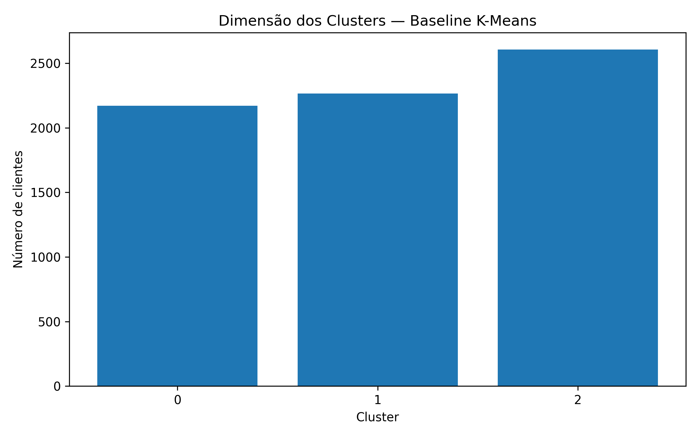

Esta figura apresenta a dimensão dos três clusters obtidos pelo modelo baseline. A distribuição é relativamente equilibrada, sem clusters residuais. No entanto, o equilíbrio na dimensão dos grupos não garante, por si só, uma boa separação entre eles.

### Figura 2 — Visualização PCA do baseline

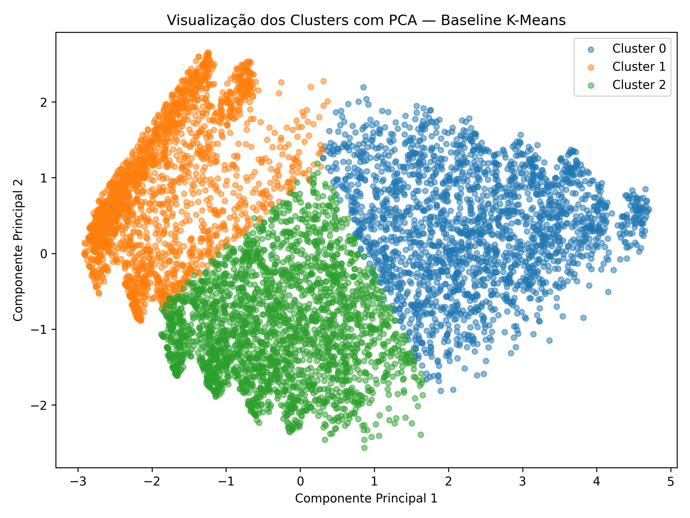

A visualização PCA projeta os dados em duas componentes principais. No baseline, a variância explicada acumulada pelas duas primeiras componentes foi de aproximadamente **0,5983**. A figura permite observar a distribuição dos grupos num espaço bidimensional, mas não mostra uma separação muito forte entre clusters, o que está de acordo com o Silhouette relativamente baixo.

---

### 2.2. Modelos Candidatos

Após o baseline, foram testados vários modelos candidatos para verificar se era possível melhorar a qualidade da segmentação.

Foram executadas **43 experiências iniciais**, distribuídas por:

| Modelo                   | Nº de configurações |
| ------------------------ | ------------------: |
| K-Means                  |                   8 |
| MiniBatch K-Means        |                   8 |
| Agglomerative Clustering |                  12 |
| DBSCAN                   |                  15 |

A escolha destes algoritmos teve como objetivo comparar diferentes abordagens de clustering:

* **K-Means**: algoritmo de particionamento usado como referência;
* **MiniBatch K-Means**: variante mais eficiente do K-Means;
* **Agglomerative Clustering**: algoritmo hierárquico;
* **DBSCAN**: algoritmo baseado em densidade.

#### Ranking inicial dos modelos candidatos no conjunto de teste

| Modelo                   | Parâmetros base                      | Nº de clusters | Silhouette teste | Davies-Bouldin teste | Notas                                                                  |
| ------------------------ | ------------------------------------ | -------------: | ---------------: | -------------------: | ---------------------------------------------------------------------- |
| K-Means                  | `k=3`, `init=k-means++`, `n_init=10` |              3 |           0,2194 |               1,5860 | Melhor resultado inicial no teste                                      |
| K-Means                  | `k=3`, `init=k-means++`, `n_init=20` |              3 |           0,2194 |               1,5860 | Resultado equivalente ao anterior                                      |
| MiniBatch K-Means        | `k=3`, `batch_size=1024`             |              3 |           0,2191 |               1,5888 | Muito próximo do K-Means                                               |
| MiniBatch K-Means        | `k=3`, `batch_size=512`              |              3 |           0,2188 |               1,5926 | Resultado próximo do baseline                                          |
| Agglomerative Clustering | `k=3`, `linkage=average`             |              3 |           0,2025 |               1,5544 | Menor Silhouette, mas Davies-Bouldin competitivo                       |
| Agglomerative Clustering | `k=3`, `linkage=ward`                |              3 |           0,1985 |               1,5448 | Menor separação segundo Silhouette                                     |
| DBSCAN                   | várias configurações                 |       variável |  não competitivo |      não competitivo | Não apresentou solução válida e competitiva nas configurações testadas |

O melhor modelo candidato inicial foi o **K-Means com 3 clusters**, com **Silhouette de 0,2194** no conjunto de teste. No entanto, este resultado continuou abaixo do valor mínimo de 0,24 definido no Objetivo SMART.

### Figura 3 — Comparação dos modelos candidatos

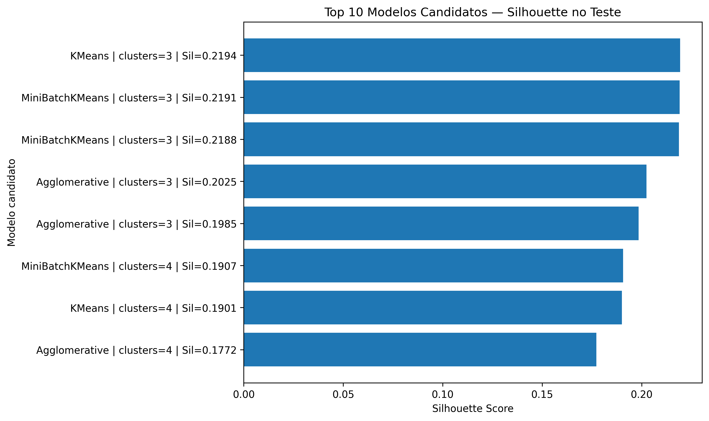

Este gráfico compara os principais modelos candidatos através do Silhouette Score. A análise mostra que K-Means e MiniBatch K-Means obtiveram os melhores resultados iniciais, mas sem melhoria suficiente face ao objetivo quantitativo definido.

### Figura 4 — Método do Cotovelo

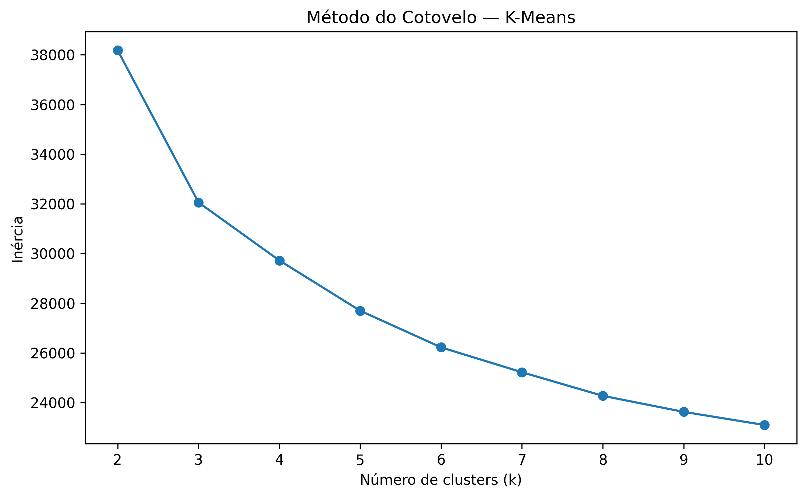

O Método do Cotovelo foi usado como apoio visual para analisar a evolução da inércia em função do número de clusters. Esta figura ajuda a compreender se existe um ponto em que o aumento do número de clusters deixa de trazer uma redução significativa da inércia. No entanto, como o objetivo do projeto define 3 perfis, a decisão final não foi baseada apenas na inércia, mas também no alinhamento com o SMART e nas métricas de coesão/separação.

---

## 3. Otimização (Tuning)

### 3.1. Otimização inicial do K-Means

Na primeira fase de otimização, foi realizada uma pesquisa manual de hiperparâmetros para o K-Means, com validação cruzada manual.

Foram testadas **64 configurações** de K-Means, variando parâmetros como:

* `n_clusters`;
* `init`;
* `n_init`;
* `max_iter`;
* `algorithm`;
* `random_state`.

A validação cruzada foi feita com 5 folds, permitindo calcular a média e o desvio-padrão das métricas entre diferentes partições dos dados.

A melhor configuração K-Means com 3 clusters foi:

```python
{
    "n_clusters": 3,
    "init": "random",
    "n_init": 20,
    "max_iter": 300,
    "algorithm": "elkan",
    "random_state": 42
}
```

Resultados médios em validação cruzada:

| Modelo            | Nº de clusters | Silhouette médio CV | Desvio-padrão CV | Davies-Bouldin médio |
| ----------------- | -------------: | ------------------: | ---------------: | -------------------: |
| K-Means otimizado |              3 |              0,2159 |           0,0049 |               1,6129 |

O desvio-padrão reduzido indica alguma estabilidade do modelo entre folds, mas a melhoria face ao baseline não foi material.

#### Comparação entre K-Means baseline e K-Means otimizado

| Modelo            | Nº de clusters | Silhouette | Davies-Bouldin | Calinski-Harabasz |    Inércia |
| ----------------- | -------------: | ---------: | -------------: | ----------------: | ---------: |
| K-Means Baseline  |              3 |     0,2161 |         1,6154 |         2734,0298 | 32059,2893 |
| K-Means Otimizado |              3 |     0,2161 |         1,6155 |         2734,0301 | 32059,3038 |

A otimização do K-Means não produziu uma melhoria relevante. Assim, esta fase serviu sobretudo para confirmar que o K-Means com 3 clusters era relativamente estável, mas limitado na capacidade de separar os clientes de forma suficientemente clara.

### Figura 5 — Estabilidade das configurações K-Means

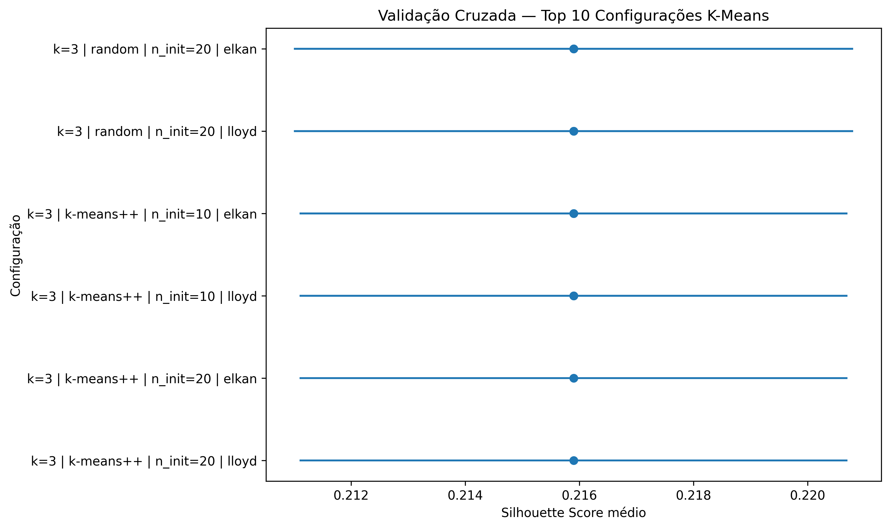

Este gráfico mostra a estabilidade das melhores configurações testadas em validação cruzada. Os valores de Silhouette são próximos entre si, o que sugere que a alteração dos hiperparâmetros do K-Means não foi suficiente para melhorar significativamente a segmentação.

### Figura 6 — Comparação baseline vs K-Means otimizado

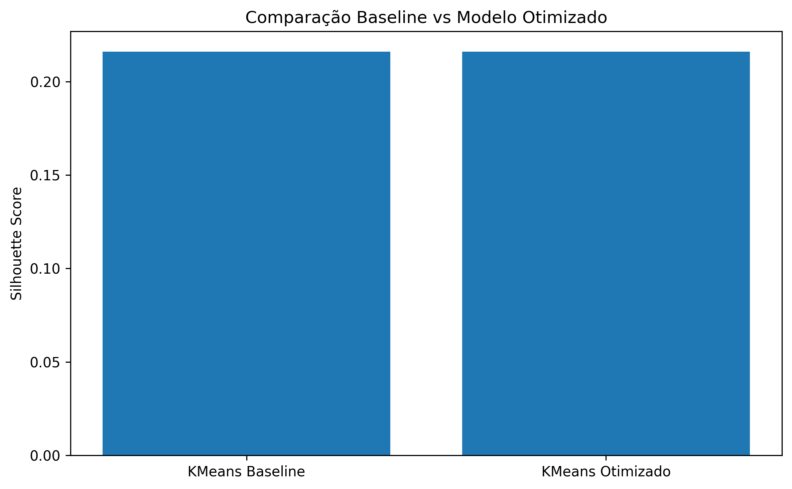

A figura confirma visualmente que o K-Means otimizado não apresentou melhoria material em relação ao K-Means baseline. Ambos os modelos ficaram com Silhouette de aproximadamente **0,2161**.

### Figura 7 — Curva de estabilidade do K-Means por tamanho de amostra

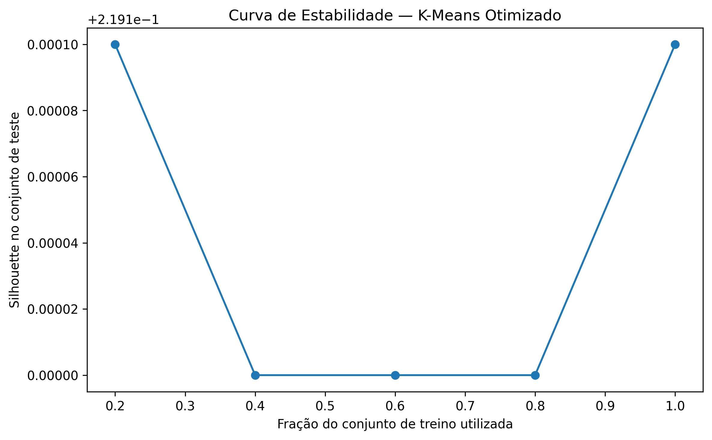

Esta curva avalia a estabilidade do modelo com diferentes frações do conjunto de treino. O Silhouette manteve-se próximo de **0,219** nas diferentes frações, o que sugere estabilidade, mas também confirma que o K-Means não estava a atingir o nível mínimo pretendido no Objetivo SMART.

---

### 3.2. Otimização avançada dos modelos candidatos

Como o K-Means otimizado não atingiu o valor mínimo de Silhouette definido no objetivo, foi realizada uma etapa de otimização avançada.

Nesta fase foram testadas novas famílias de modelos e novas representações dos dados:

* K-Means com grelha alargada;
* MiniBatch K-Means;
* Bisecting K-Means;
* Gaussian Mixture Models;
* BIRCH;
* variantes com PCA;
* variante com variáveis numéricas e de engenharia.

Modelos como Spectral Clustering, OPTICS e HDBSCAN foram considerados, mas não integrados na versão final da procura rápida devido ao maior custo computacional no Kaggle.

Para reduzir o tempo de execução, a otimização avançada foi feita em duas etapas:

1. ranking inicial numa amostra de até 3000 observações;
2. avaliação dos melhores modelos no dataset completo.

Foram usadas várias variantes do espaço de atributos, incluindo:

* `Atual_M2`;
* `Atual_M2_PCA80`;
* `Atual_M2_PCA90`;
* `Numericas_Engenharia`.

A variante `Numericas_Engenharia` apresentou os melhores resultados. Esta melhoria sugere que uma representação mais simples e focada em variáveis numéricas e atributos de engenharia reduziu ruído e melhorou a separação entre segmentos.

#### Melhor modelo global encontrado

| Modelo          | Variante             | Nº de clusters | Silhouette | Davies-Bouldin | Calinski-Harabasz | Cluster mínimo |
| --------------- | -------------------- | -------------: | ---------: | -------------: | ----------------: | -------------: |
| GaussianMixture | Numericas_Engenharia |              2 |     0,4377 |         0,8396 |         7232,9524 |         31,55% |

O melhor modelo global foi um **Gaussian Mixture Model com 2 clusters**, com Silhouette de **0,4377**. Apesar de apresentar o melhor desempenho global, este modelo **não foi escolhido como modelo final**, porque o Objetivo SMART do projeto define a identificação de **3 perfis de clientes**.

#### Melhor modelo alinhado com o Objetivo SMART

| Modelo          | Variante             | Nº de clusters | Silhouette | Davies-Bouldin | Calinski-Harabasz | Cluster mínimo |
| --------------- | -------------------- | -------------: | ---------: | -------------: | ----------------: | -------------: |
| GaussianMixture | Numericas_Engenharia |              3 |     0,3947 |         0,9626 |         7142,2309 |         29,62% |

O melhor modelo com 3 clusters foi o **GaussianMixture com covariance_type='spherical'**, `n_components=3`, `n_init=5` e `random_state=42`.

Este modelo foi selecionado como solução final porque:

* respeita o objetivo de identificar 3 perfis de clientes;
* ultrapassa claramente o valor mínimo de Silhouette definido no SMART;
* apresenta clusters com dimensão equilibrada;
* melhora substancialmente o desempenho do K-Means inicial e otimizado;
* mantém uma segmentação interpretável.

#### Comparação final entre modelo atual, melhor global e melhor modelo com 3 clusters

| Cenário                        | Variante             | Modelo            | Nº de clusters | Silhouette | Davies-Bouldin | Cluster mínimo | Melhoria da Silhouette |
| ------------------------------ | -------------------- | ----------------- | -------------: | ---------: | -------------: | -------------: | ---------------------: |
| Modelo atual                   | Atual_M2             | K-Means Otimizado |              3 |     0,2161 |         1,6155 |         30,81% |                 0,0000 |
| Melhor modelo avançado         | Numericas_Engenharia | GaussianMixture   |              2 |     0,4377 |         0,8396 |         31,55% |                 0,2216 |
| Melhor avançado com 3 clusters | Numericas_Engenharia | GaussianMixture   |              3 |     0,3947 |         0,9626 |         29,62% |                 0,1786 |

O modelo de 2 clusters foi mantido apenas como referência comparativa. A decisão final foi escolher o **GaussianMixture com 3 clusters**, por ser o melhor equilíbrio entre desempenho, alinhamento com o objetivo, estabilidade prática e interpretabilidade.

### Figura 8 — Top 15 modelos da otimização avançada

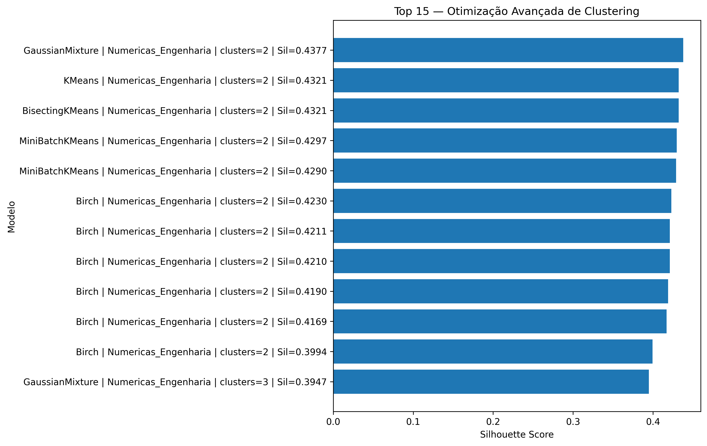

Esta figura apresenta os 15 melhores modelos da otimização avançada segundo o Silhouette Score. Observa-se que os melhores resultados surgem com a variante `Numericas_Engenharia`, o que reforça a importância da seleção e transformação de atributos na qualidade da segmentação.

---

## 4. Avaliação do Modelo Final

O modelo final selecionado foi:

| Elemento          | Valor                |
| ----------------- | -------------------- |
| Modelo            | GaussianMixture      |
| Variante de dados | Numericas_Engenharia |
| Nº de clusters    | 3                    |
| `covariance_type` | spherical            |
| `n_init`          | 5                    |
| `random_state`    | 42                   |
| Silhouette        | 0,3947               |
| Davies-Bouldin    | 0,9626               |
| Calinski-Harabasz | 7142,2309            |
| Cluster mínimo    | 29,62%               |

A avaliação final foi feita com base no modelo escolhido, usando `X_modelo_final` e `labels_modelo_final`, para garantir coerência entre a decisão final e os gráficos/estatísticas finais.

### Distribuição dos clusters finais

| Cluster | Nº de clientes | Percentagem |
| ------: | -------------: | ----------: |
|       0 |           2086 |      29,62% |
|       1 |           2298 |      32,63% |
|       2 |           2659 |      37,75% |

A distribuição é equilibrada, sem clusters residuais. O menor cluster representa 29,62% dos clientes, o que indica que os grupos encontrados têm dimensão suficiente para serem interpretados como segmentos de negócio.

### 4.1. Análise de Coesão e Separação dos Clusters

Como o problema é não supervisionado, não existe matriz de confusão nem erros de previsão no sentido tradicional. Em vez disso, a avaliação foi feita através da análise da coesão e separação dos grupos.

O Silhouette médio final calculado no gráfico de silhueta foi aproximadamente **0,3949**. Este valor é muito próximo do valor registado no ranking final da otimização avançada (**0,3947**). A pequena diferença pode resultar de arredondamentos ou da forma de cálculo/amostragem usada em cada etapa do notebook.

O resultado final supera claramente o objetivo mínimo definido no SMART:

```text
Silhouette objetivo mínimo: 0,24
Silhouette final: 0,3947
Diferença: 0,3947 - 0,24 = 0,1547
```

Assim, o modelo final cumpre o critério quantitativo do objetivo.

### Figura 9 — Silhouette Plot do modelo final

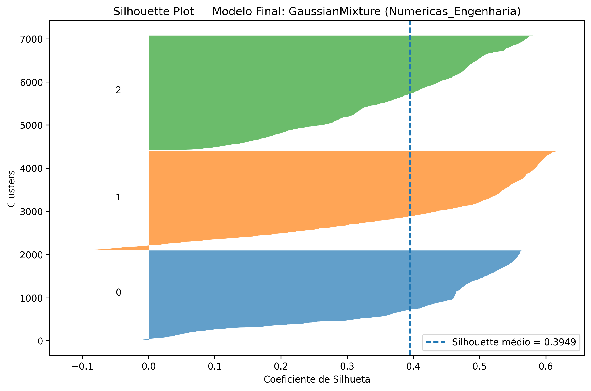

O Silhouette Plot permite avaliar a qualidade dos clusters individualmente. Quanto mais elevados forem os valores de Silhouette, melhor é a atribuição dos clientes ao respetivo cluster. O valor médio de aproximadamente **0,3949** indica uma separação superior à obtida com o K-Means inicial, embora não seja perfeita. Isto significa que os grupos têm estrutura interpretável, mas ainda existe alguma proximidade entre segmentos.

### Figura 10 — Visualização PCA do modelo final

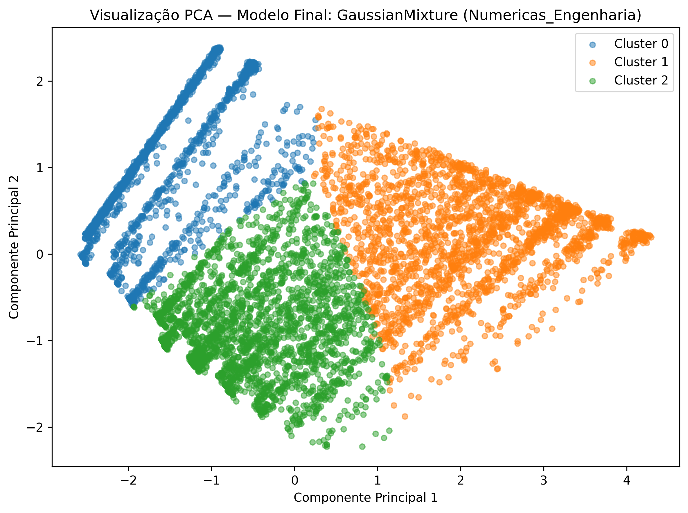

A visualização PCA projeta os clientes em duas componentes principais. No modelo final, as duas primeiras componentes explicaram aproximadamente **90,5%** da variância acumulada:

| Componente | Variância explicada |
| ---------- | ------------------: |
| PC1        |              0,6967 |
| PC2        |              0,2083 |
| Total      |              0,9050 |

Esta projeção permite observar a separação dos três segmentos num espaço bidimensional. Como a variância acumulada é elevada, a visualização PCA é uma representação útil da estrutura dos dados usada pelo modelo final.

---

### 4.2. Perfil dos Segmentos

A caracterização dos clusters foi feita com base nos dados originais tratados na Milestone 2, para tornar a interpretação dos segmentos mais próxima do contexto de negócio.

#### Perfil numérico dos clusters

| Cluster | tenure médio | MonthlyCharges médio | TotalCharges médio | ServiceCount médio | AvgChargePerTenure médio |
| ------: | -----------: | -------------------: | -----------------: | -----------------: | -----------------------: |
|       0 |        27,61 |                25,52 |             689,62 |               1,25 |                    25,47 |
|       1 |        57,29 |                89,79 |            5127,99 |               5,56 |                    89,85 |
|       2 |        14,57 |                73,92 |            1065,63 |               3,12 |                    73,74 |

#### Cluster 0 — Clientes com baixo consumo e menor utilização de serviços

O Cluster 0 representa **2086 clientes**, correspondendo a **29,62%** do total. Este grupo apresenta:

* `MonthlyCharges` médio baixo: 25,52;
* `ServiceCount` médio baixo: 1,25;
* `TotalCharges` médio baixo: 689,62;
* forte presença de clientes sem serviço de Internet;
* maior peso de pagamentos por mailed check;
* maior proporção de contratos month-to-month, embora também existam clientes com contratos mais longos.

Este grupo parece representar clientes com menor intensidade de utilização dos serviços, custos mensais baixos e menor subscrição de serviços adicionais. Pode ser interpretado como um segmento de clientes de baixo valor mensal, potencialmente mais simples do ponto de vista contratual e tecnológico.

#### Cluster 1 — Clientes antigos, com maior consumo e maior subscrição de serviços

O Cluster 1 representa **2298 clientes**, correspondendo a **32,63%** do total. Este grupo apresenta:

* maior `tenure` médio: 57,29;
* maior `MonthlyCharges` médio: 89,79;
* maior `TotalCharges` médio: 5127,99;
* maior `ServiceCount` médio: 5,56;
* maior presença de clientes com múltiplos serviços;
* maior peso de contratos de longa duração;
* maior utilização de métodos de pagamento automáticos.

Este grupo parece representar clientes mais antigos, com maior envolvimento com a empresa, maior consumo mensal e maior número de serviços contratados. É provavelmente o segmento de maior valor comercial.

#### Cluster 2 — Clientes recentes com encargos mensais elevados

O Cluster 2 representa **2659 clientes**, correspondendo a **37,75%** do total. Este grupo apresenta:

* menor `tenure` médio: 14,57;
* `MonthlyCharges` médio elevado: 73,92;
* `TotalCharges` médio relativamente baixo: 1065,63;
* `ServiceCount` médio intermédio: 3,12;
* maior presença de clientes com serviço de Internet;
* maior peso de contratos month-to-month.

Este grupo parece representar clientes mais recentes, com encargos mensais relativamente elevados, mas ainda com baixo valor acumulado devido ao menor tempo de permanência. Pode ser um segmento importante para ações de acompanhamento inicial e gestão da relação com o cliente.

### Figura 11 — Perfil dos segmentos

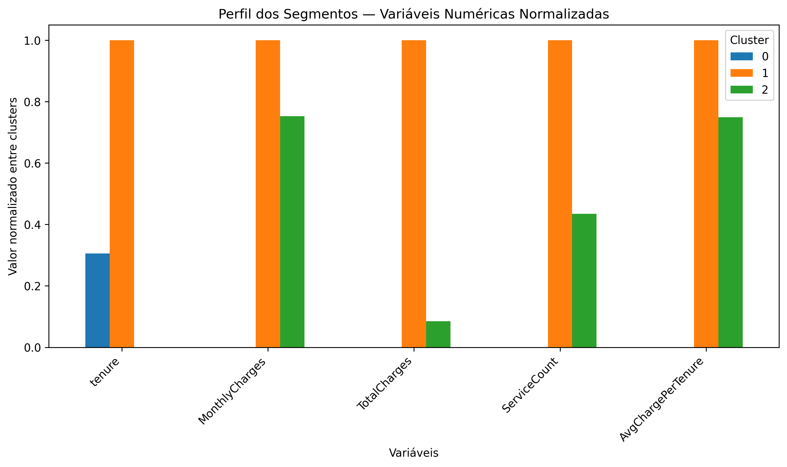

O gráfico de perfil dos segmentos compara as principais variáveis numéricas dos clusters numa escala normalizada. A figura mostra que:

* o Cluster 0 tem valores baixos em mensalidade, número de serviços e valor acumulado;
* o Cluster 1 apresenta os valores mais elevados em praticamente todas as variáveis de consumo e permanência;
* o Cluster 2 combina baixa permanência com mensalidade elevada.

Esta figura é importante porque traduz os resultados estatísticos do clustering em perfis interpretáveis de negócio.

---

### 4.3. Variáveis que mais distinguem os clusters

As variáveis diferenciadoras foram identificadas através dos desvios das médias de cada cluster face à média global.

Principais variáveis diferenciadoras por cluster:

| Cluster | Variáveis mais relevantes                                              | Interpretação                                                        |
| ------: | ---------------------------------------------------------------------- | -------------------------------------------------------------------- |
|       0 | MonthlyCharges, ServiceCount, TotalCharges, HasInternetService, tenure | Clientes com baixo consumo, poucos serviços e menor valor acumulado  |
|       1 | TotalCharges, ServiceCount, tenure, MonthlyCharges, HasInternetService | Clientes antigos, com muitos serviços e elevado valor acumulado      |
|       2 | tenure, TotalCharges, MonthlyCharges, HasInternetService, ServiceCount | Clientes recentes, com mensalidade elevada mas menor valor acumulado |

Esta análise confirma que os três perfis são caracterizáveis por pelo menos cinco variáveis relevantes, tal como definido no Objetivo SMART.

---

## 5. Conclusão da Fase de Modelação

A fase de modelação permitiu comparar diferentes estratégias de clustering e selecionar um modelo final coerente com o objetivo do projeto.

Inicialmente, o K-Means baseline com 3 clusters obteve um Silhouette de **0,2161** no dataset completo. Este valor ficou abaixo do mínimo definido no objetivo SMART. A otimização do K-Means, mesmo com validação cruzada e pesquisa de hiperparâmetros, não gerou melhoria material, mantendo o Silhouette em **0,2161**.

A fase de otimização avançada permitiu testar novas famílias de modelos e novas representações dos dados. O melhor modelo global encontrado foi um GaussianMixture com 2 clusters, com Silhouette de **0,4377**. No entanto, este modelo não foi escolhido como solução final porque não respeitava o objetivo de identificar **3 perfis de clientes**.

O modelo final selecionado foi o **GaussianMixture com 3 clusters**, aplicado à variante `Numericas_Engenharia`, com:

* Silhouette: **0,3947**;
* Davies-Bouldin: **0,9626**;
* Calinski-Harabasz: **7142,2309**;
* cluster mínimo: **29,62%**;
* três grupos interpretáveis e equilibrados.

Este modelo cumpre o objetivo SMART, porque identifica 3 perfis de clientes, supera o valor mínimo de Silhouette definido e permite caracterizar cada perfil através de várias variáveis relevantes.

### Resposta à questão crítica da Milestone 3

O modelo é fiável e resolve o problema definido?

A resposta é **parcialmente positiva**. O modelo final é adequado como solução descritiva de segmentação, porque apresenta melhor separação dos grupos do que o baseline, cumpre o critério quantitativo definido e gera segmentos interpretáveis para apoio à gestão comercial e relacionamento com clientes.

No entanto, é importante realçar que este modelo não prevê abandono de clientes. O modelo identifica perfis de clientes com características semelhantes. Qualquer utilização posterior para decisões de retenção deve ser feita como apoio exploratório e não como previsão direta de churn.

### Limitações

As principais limitações identificadas são:

1. O modelo é não supervisionado, pelo que não existe uma variável-alvo para validar se os clusters correspondem diretamente a risco de abandono.
2. A interpretação dos clusters depende das variáveis disponíveis no dataset.
3. A variante final `Numericas_Engenharia` usa uma representação mais reduzida dos dados, o que melhora a separação, mas pode deixar de fora alguma informação categórica.
4. A validação cruzada explícita foi aplicada inicialmente ao K-Means; a escolha final do GaussianMixture foi baseada na otimização avançada e na avaliação no dataset completo. Caso necessário, pode ser acrescentada uma validação K-Fold específica para o GaussianMixture final.

### Decisão final

A decisão final foi selecionar o modelo:

```text
GaussianMixture
Variante: Numericas_Engenharia
Nº de clusters: 3
covariance_type: spherical
n_init: 5
random_state: 42
```

Este modelo será usado como base para a fase seguinte do projeto, onde os perfis obtidos poderão ser convertidos em recomendações de negócio.

---

## Ficheiros e evidências produzidas

Durante a Milestone 3 foram gerados ficheiros intermédios em `data/processed/` e figuras em `reports/figures/`.

Principais figuras usadas no relatório:

| Figura                                 | Ficheiro                                                             |
| -------------------------------------- | -------------------------------------------------------------------- |
| Distribuição dos clusters baseline     | `reports/figures/m3_baseline_kmeans_dimensao_clusters.png`           |
| PCA do baseline                        | `reports/figures/m3_baseline_kmeans_pca_2d.png`                      |
| Comparação dos modelos candidatos      | `reports/figures/m3_comparacao_modelos_candidatos_silhouette.png`    |
| Método do Cotovelo                     | `reports/figures/m3_elbow_method_kmeans.png`                         |
| Estabilidade das configurações K-Means | `reports/figures/m3_kmeans_cross_validation_top_configuracoes.png`   |
| Comparação baseline vs otimizado       | `reports/figures/m3_comparacao_baseline_vs_otimizado_silhouette.png` |
| Curva de estabilidade K-Means          | `reports/figures/m3_curva_estabilidade_kmeans.png`                   |
| Top 15 modelos avançados               | `reports/figures/m3_top15_otimizacao_avancada_silhouette.png`        |
| Silhouette Plot final                  | `reports/figures/m3_silhouette_plot_modelo_final.png`                |
| PCA do modelo final                    | `reports/figures/m3_pca_modelo_final.png`                            |
| Perfil dos segmentos                   | `reports/figures/m3_perfil_segmentos_variaveis_numericas.png`        |

---

*Data de última atualização: 12/06/2026*

